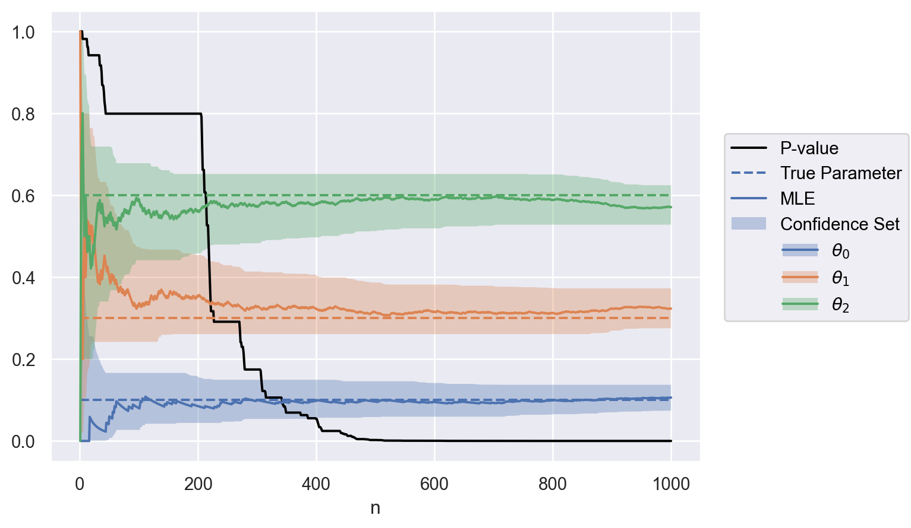
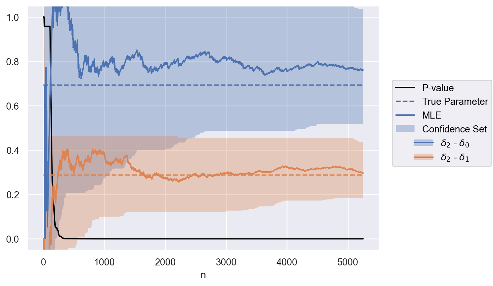
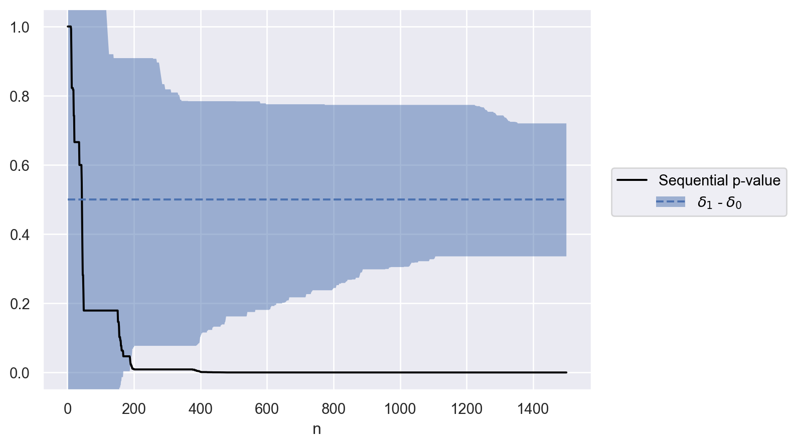

# savvi


- [Install](#install)
- [Examples](#examples)
  - [Multinomial](#multinomial)
    - [Multinomial Test](#multinomial-test)
    - [Inhomogeneous Bernoulli
      Process](#inhomogeneous-bernoulli-process)
    - [Inhomogeneous Poisson Counting
      Process](#inhomogeneous-poisson-counting-process)
- [References](#references)

savvi is a package for Safe Anytime Valid Inference. Also, it’s a savvy
pun.

From Ramdas et al. ([2023](#ref-ramdas2023gametheoretic)):

> Safe anytime-valid inference (SAVI) provides measures of statistical
> evidence and certainty – e-processes for testing and confidence
> sequences for estimation – that remain valid at all stopping times,
> accommodating continuous monitoring and analysis of accumulating data
> and optional stopping or continuation for any reason.

## Install

``` shell
pip install git+https://github.com/assuncaolfi/savvi
```

For development, use [pdm](https://github.com/pdm-project/pdm).

## Examples

### Multinomial

Implementation of tests from Anytime-Valid Inference for Multinomial
Count Data ([Lindon and Malek 2022](#ref-lindon2022anytimevalid)).
Application examples were also adapted from the same publication.

                <script type="application/javascript" id="jupyter_black">
                function jb_set_cell(
                        jb_formatted_code
                        ) {
                    for (var cell of Jupyter.notebook.get_cells()) {
                        if (cell.input_prompt_number == "*") {
                            cell.set_text(jb_formatted_code)
                            return
                        }
                    }
                }
                </script>
                &#10;
#### Multinomial Test

*Application: sample ratio mismatch.*

Consider a new experimental unit $n$ is assigned to one of
$i \in \{1, 2, 3\}$ groups. Therefore, groups are
$\mathrm{Multinomial}(1, \mathbf{\theta})$ distributed, with
$\mathbf{\theta} = [0.1, 0.3, 0.6]$.

``` python
import numpy as np

np.random.seed(1)
theta = np.array([0.1, 0.3, 0.6])
size = 1000
xs = np.random.multinomial(1, theta, size=size)
print(xs)
```

    [[0 1 0]
     [0 0 1]
     [0 0 1]
     ...
     [0 1 0]
     [1 0 0]
     [0 0 1]]

We can test the hypothesis

$$
\begin{align}
H_0: \mathbf{\theta} = \mathbf{\theta_0} \\
H_1: \mathbf{\theta} \neq \mathbf{\theta_0}
\end{align}
$$

with $\mathbf{\theta_0} = [0.1, 0.3, 0.6]$, as well as estimate
confidence sequences for $\theta$ at a significance level $u$ using the
default Multinomial test:

``` python
from savvi import Multinomial

u = 0.05
theta_0 = np.array([0.1, 0.4, 0.5])
test = Multinomial(0.05, theta_0)
test.__dict__
```

    {'u': 0.05,
     'n': 0,
     'odds': 1.0,
     'p': 1.0,
     'theta_0': array([0.1, 0.4, 0.5]),
     'theta': Variable((3,), theta),
     'delta': Variable((3,), delta),
     'hypothesis': [],
     'alpha_0': array([10., 40., 50.]),
     'alpha': array([10., 40., 50.]),
     'counts': array([0, 0, 0]),
     'confidence_set': array([[-inf,  inf],
            [-inf,  inf],
            [-inf,  inf]]),
     '_weights': array([], dtype=float64)}

For each new unit sample $n$, we run the test. If $p_n < u$, we have the
option to stop running:

``` python
import cvxpy as cp


def run_sequence(test, xs, **kwargs):
    size = xs.shape[0]
    sequence = [None] * size
    stop = np.inf
    for n, x in enumerate(xs):
        test.update(x, **kwargs)
        sequence[n] = {
            "n": test.n,
            "p": test.p,
            "confidence_set": test.confidence_set.tolist(),
        }
        if test.p <= u:
            stop = min(stop, n)
    optional_stop = sequence[stop]
    return sequence, optional_stop


solver = cp.CLARABEL
sequence, optional_stop = run_sequence(test, xs, solver=solver)
optional_stop
```

    {'n': 402,
     'p': 0.04845591105969517,
     'confidence_set': [[0.056684768115202705, 0.1493967591525672],
      [0.2608987241982874, 0.4028302603098119],
      [0.4971209299792429, 0.6517617329309116]]}

<details class="code-fold">
<summary>Code</summary>

``` python
import polars as pl
import seaborn.objects as so


def to_df(sequence, parameter, value):
    size = len(sequence)
    data = (
        pl.from_dicts(sequence)
        .explode("confidence_set")
        .with_columns(
            confidence_set=pl.col("confidence_set").list.to_struct(
                fields=["lower", "upper"]
            ),
            parameter=pl.Series(parameter * size),
            value=pl.Series(value.tolist() * size),
        )
        .unnest("confidence_set")
    )
    return data


def plot(data):
    plot = (
        so.Plot(data.to_pandas(), x="n")
        .add(so.Line(color="black"), y="p", label="Sequential p-value")
        .add(so.Line(linestyle="dashed"), y="value", color="parameter")
        .add(
            so.Band(alpha=1 / theta.size), ymin="lower", ymax="upper", color="parameter"
        )
        .label(color="", y="")
        .limit(y=(-0.05, 1.05))
    )
    return plot


parameter = [f"$\\theta_{i}$" for i in np.arange(0, theta.size)]
data = to_df(sequence, parameter, theta)
plot(data)
```

</details>



#### Inhomogeneous Bernoulli Process

*Application: conversion rate optimization when all groups share a
common multiplicative time-varying effect.*

Suppose a new experimental unit $n$ is randomly assigned to one of
$i \in \{1, 2, 3\}$ experiment treatment groups at time $t$, with
assignment probabilities $\mathbf{\rho} = [0.1, 0.3, 0.6]$, and a
Bernoulli outcome is observed with probability
$p_i(t) = \exp(\mu(t) + \delta_{i})$,
$\mathbf{\delta} = [\log 0.2, \log 0.3, \log 0.4]$. The conditional
probability that the next Bernoulli success comes from group $i$ is

$$
\theta_i = \frac{\rho_i \exp(\theta_i)}{\sum_{j=1}^d \rho_j \exp(\theta_j)}.
$$

Therefore, the next Bernoulli success comes from a random group,
$\mathrm{Multinomial}(1, \mathbf{\theta})$ distributed, with
$\mathbf{\theta} \approx [0.05, 0.25, 0.68]$.

``` python
rho = np.array([0.1, 0.3, 0.6])
delta = np.log([0.2, 0.3, 0.4])
theta = rho * np.exp(delta) / np.sum(rho * np.exp(delta))
size = 5250
xs = np.random.multinomial(1, theta, size=size)
print(xs)
```

    [[0 1 0]
     [0 1 0]
     [0 1 0]
     ...
     [0 0 1]
     [0 0 1]
     [0 0 1]]

We can test the hypothesis

$$
\begin{align}
H_0: \delta_0 \geq \delta_1, \delta_0 \geq \delta_2 \\
H_1: \delta_0 \lt \delta_1, \delta_0 \lt \delta_2
\end{align}
$$

using a Multinomial test with $\mathbf{\theta}_0 = \mathbf{\rho}$ and a
list of inequalities for $\mathbf{\delta}$:

``` python
test = Multinomial(u, rho)
test.hypothesis = [
    test.delta[0] >= test.delta[1],
    test.delta[0] >= test.delta[2],
]
```

We can also set contrast weights $[-1, 0, 1]$ and $[0, -1, 1]$ to
estimate confidence sequences for $\delta_2 - \delta_0$ and
$\delta_2 - \delta_1$ at a significance level $u$:

``` python
test.weights = np.array([[-1, 0, 1], [0, -1, 1]])
```

For each new unit sample $n$, we run the test. If $p_n < u$, we have the
option to stop running:

``` python
sequence, optional_stop = run_sequence(test, xs, solver=solver)
optional_stop
```

    {'n': 210,
     'p': 0.04861129531258319,
     'confidence_set': [[0.0020567122072947704, 1.4880052569753974],
      [-0.3216759113208812, 0.4627565948192972]]}

<details class="code-fold">
<summary>Code</summary>

``` python
parameter = ["$\\delta_2$ - $\\delta_0$", "$\\delta_2$ - $\\delta_1$"]
contrasts = test.weights @ delta
data = to_df(sequence, parameter, contrasts)
plot(data)
```

</details>



#### Inhomogeneous Poisson Counting Process

*Application: software canary testing when all processes share a common
multiplicative time-varying effect.*

Consider points are observed from one of $i \in \{1, 2\}$ Poisson point
processes with intensity functions
$\lambda_i(t) = \rho_i \exp(\delta_i) \lambda(t)$, with
$\rho = [0.8, 0.2]$ and $\delta = [1.5, 2]$. The probability that the
next point comes from process $i$ is

$$
\theta_i = \frac{\rho_i \exp(\theta_i)}{\sum_{j=1}^d \rho_j \exp(\theta_j)}.
$$

Therefore, the next point comes from a random process, distributed as
$\mathrm{Multinomial}(1, \mathbf{\theta})$, with
$\mathbf{\theta} \approx [0.7, 0.3]$.

``` python
rho = np.array([0.8, 0.2])
delta = np.array([1.5, 2])
theta = rho * np.exp(delta) / np.sum(rho * np.exp(delta))
size = 1500
xs = np.random.multinomial(1, theta, size=size)
print(xs)
```

    [[1 0]
     [0 1]
     [1 0]
     ...
     [0 1]
     [1 0]
     [0 1]]

We can test the hypothesis

$$
\begin{align}
H_0: \delta_1 - \delta_0 = 0 \quad (\mathbf{\theta} = \mathbf{\rho}) \\
H_1: \delta_1 - \delta_0 \neq 0  \quad (\mathbf{\theta} \neq \mathbf{\rho})
\end{align}
$$

using a Multinomial test with $\mathbf{\theta}_0 = \mathbf{\rho}$:

``` python
test = Multinomial(u, rho)
```

We can also set contrast weights $[-1, 1]$ to estimate confidence
sequences for $\theta_1 - \theta_0$ at a significance level $u$:

``` python
test.weights = np.array([[-1, 1]])
```

For each new unit sample $n$, we run the test. If $p_n < u$, we have the
option to stop running:

``` python
sequence, optional_stop = run_sequence(test, xs, solver=solver)
optional_stop
```

    {'n': 168,
     'p': 0.04675270375081281,
     'confidence_set': [[0.0036592933902448955, 0.9085292981365327]]}

<details class="code-fold">
<summary>Code</summary>

``` python
parameter = ["$\\delta_1$ - $\\delta_0$"]
contrasts = test.weights @ delta
data = to_df(sequence, parameter, contrasts)
plot(data)
```

</details>



# References

<div id="refs" class="references csl-bib-body hanging-indent"
entry-spacing="0">

<div id="ref-lindon2022anytimevalid" class="csl-entry">

Lindon, Michael, and Alan Malek. 2022. “Anytime-Valid Inference for
Multinomial Count Data.” In *Advances in Neural Information Processing
Systems*, edited by Alice H. Oh, Alekh Agarwal, Danielle Belgrave, and
Kyunghyun Cho. <https://openreview.net/forum?id=a4zg0jiuVi>.

</div>

<div id="ref-ramdas2023gametheoretic" class="csl-entry">

Ramdas, Aaditya, Peter Grünwald, Vladimir Vovk, and Glenn Shafer. 2023.
“Game-Theoretic Statistics and Safe Anytime-Valid Inference.”
<https://arxiv.org/abs/2210.01948>.

</div>

</div>
